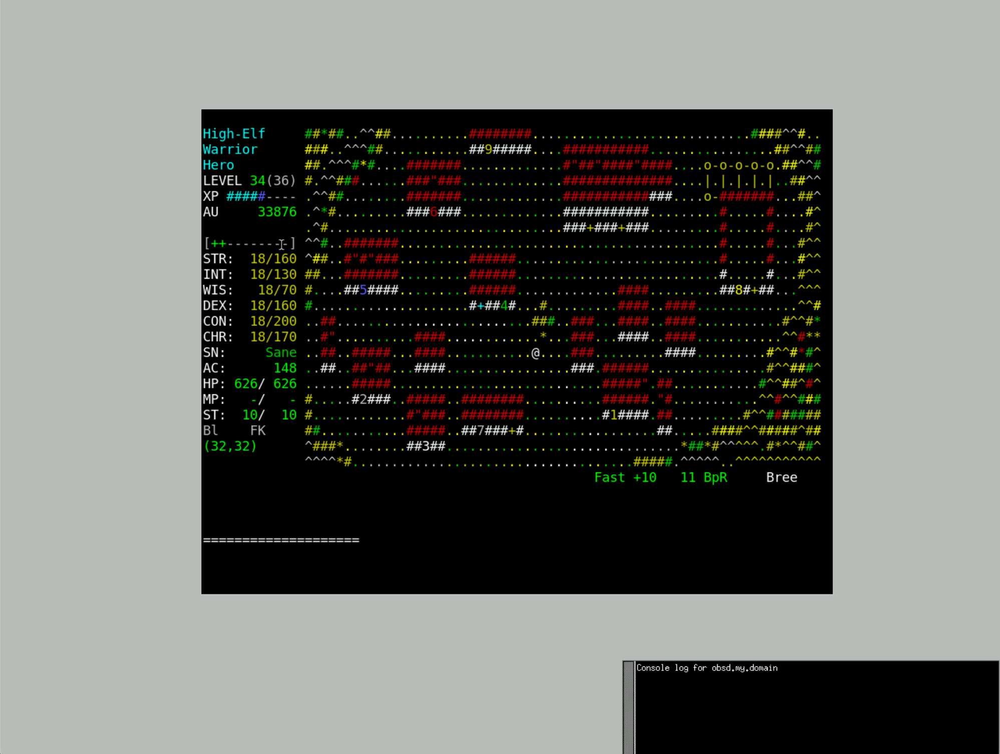
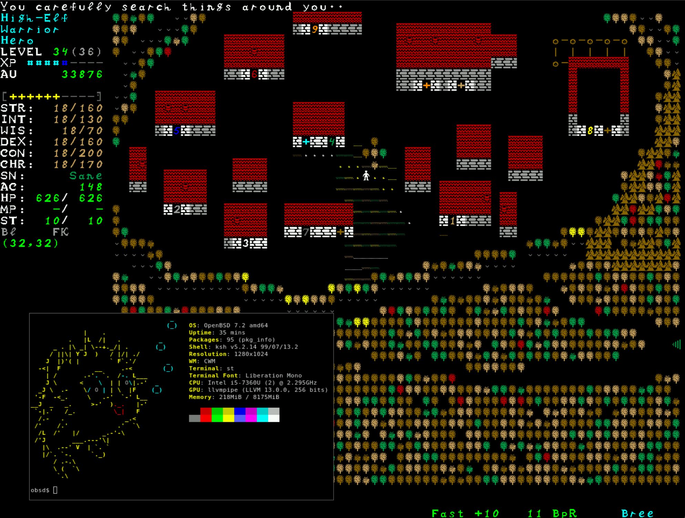

# TomeNET OpenBSD builder
This script will download and build the [TomeNET](https://www.tomenet.eu) game with resources

### Usage
```bash
$ ./tomenet-openbsd-builder.sh
...
Complete!
$ cd tomenet-4.8.0
$ ./tomenet -c
```


```bash
$ ./tomenet-tgfnt.sh
```

